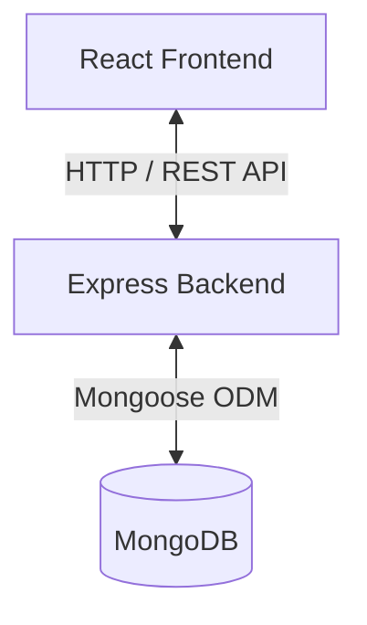
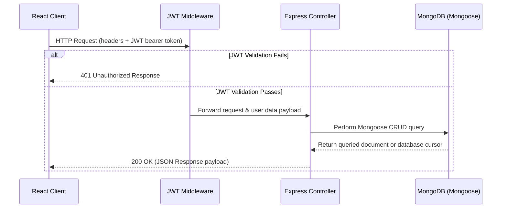
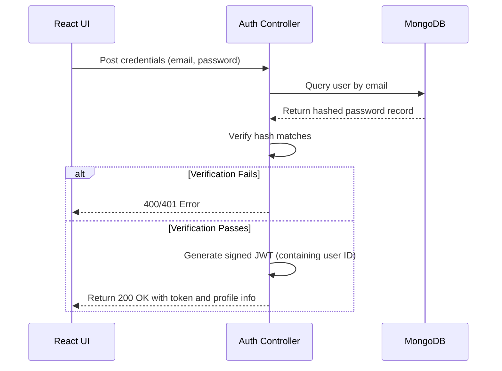

# System Architecture

This document describes the architectural design, folder layout, data flows, and scalability patterns for the **Shipyard** application.

---

## High-Level Architecture Overview

Shipyard is built as a decoupled **Client-Server** application using the **MERN (MongoDB, Express, React, Node)** tech stack.



---

## Subsystem Details

### 1. Client Subsystem
The frontend is a React-based single-page application (SPA).
*   **State Management**: Standard React Context API for localized states (e.g., user authentication credentials) and component-level hooks for transient state.
*   **Routing**: React Router DOM handling client-side views and route protection.
*   **Styling**: Structured Vanilla CSS / CSS Modules for modular, scoped UI layout.
*   **API Layer**: Axios module configured with an interceptor to attach bearer credentials dynamically to all outgoing requests.

### 2. Server Subsystem
The backend is a Node.js web application built with the Express framework.
*   **Web Framework**: Express, handling router configurations, request validations, and request-response lifecycles.
*   **Database Interface**: Mongoose ODM modeling application schemas and managing query optimization patterns.
*   **Security Stack**: Helmet, CORS middleware configuration, and JSON Web Token (JWT) authorization guards.

---

## Detailed Directory Layout

```text
Shipyard-project_Sde/
├── Client/                      # React Frontend Source
│   ├── public/                  # Static assets (HTML shell, icons)
│   └── src/                     # React application logic
│       ├── components/          # Reusable presentation components
│       ├── pages/               # Main page layout views
│       ├── context/             # React context state providers
│       └── utils/               # Axios instances and helper utilities
│
├── Server/                      # Express Backend Source
│   └── src/
│       ├── config/              # Database connection bootstrap
│       ├── controllers/         # Request handling and controller functions
│       ├── models/              # Mongoose data modeling schemas
│       ├── routes/              # Express API endpoint definitions
│       └── middleware/          # Security filters and validation guards
│
├── docs/                        # Project technical documentation
│   ├── API.md                   # Endpoint specifications
│   ├── ARCHITECTURE.md          # Architectural outline (this file)
│   └── SETUP.md                 # System requirements and installation guide
│
└── .github/                     # DevOps workflows
    └── workflows/
        └── ci.yml               # Automated CI integration script
```

---

## System Workflows

### 1. Request Flow Lifecycle
The path of an HTTP request through the system:



### 2. Authentication Flow
Authentication is stateless and managed via **JSON Web Tokens (JWT)**.



---

## Database Management Flow

*   **ODM Layer Integration**: Schema definitions enforce data integrity constraints (e.g., uniqueness, email formatting, field defaults) on the server before committing data changes to the database.
*   **Connection Lifecycle**: The database connection is established synchronously when bootstrapping the Express server. Startup execution will fail immediately if connection errors are thrown.
*   **Indexing Strategy**: Unique indices are assigned to fields like `email` to accelerate authentication lookups, and compound indexes are configured on owner relationships (`owner` + `_id`) to optimize query operations.

---

## Future Scalability Plan

1.  **Horizontal Scale Out**: The backend server is kept entirely stateless, allowing it to be easily containerized (Docker) and deployed behind load balancers (e.g., Nginx, AWS ALB) for horizontal scalability.
2.  **Caching Mechanism**: Integrate Redis to cache database queries and active pipeline logs, minimizing MongoDB resource usage.
3.  **Database Scaling**: Move from standalone instances to MongoDB replica sets, or use Atlas sharding to distribute query loads.
4.  **Content Delivery Network (CDN)**: Serve the compiled frontend client from a CDN edge node (Vercel, Netlify, or CloudFront) to reduce latency and global load times.
5.  **Microservices Decomposition**: If orchestration modules require dedicated scaling, isolate routing blocks (e.g., execution metrics) into self-contained microservices.
